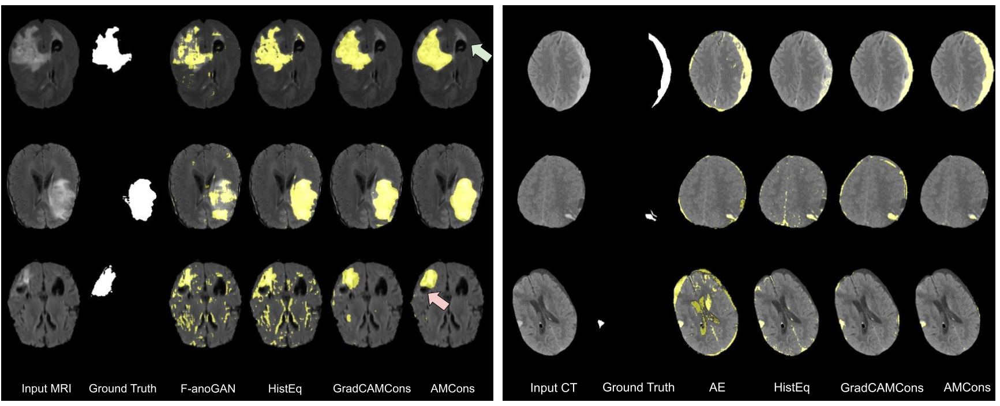

# Constrained Unsupervised Anomaly Segmentation of Brain Lesions

This repository contains code for unsupervised anomaly segmentation in brain lesions. Specifically, the implemented methods aim to constrain the optimization process to force a VAE to homogenize the activations produced in normal samples.
  
If you find these methods useful for your research, please consider citing:

**J. Silva-Rodríguez, V. Naranjo and J. Dolz, "Looking at the whole picture: constrained unsupervised anomaly segmentation", in British Machine Vision Conference (BMVC), 2021.** [(paper)](https://www.bmvc2021-virtualconference.com/assets/papers/1011.pdf)[(conference)](https://www.bmvc2021-virtualconference.com/conference/papers/paper_1011.html)

**J. Silva-Rodríguez, V. Naranjo and J. Dolz, "Constrained unsupervised anomaly segmentation",  Medical Image Analysis, vol. 80, p. 102526, 2022.** [(paper)](https://www.sciencedirect.com/science/article/pii/S1361841522001736)

## GRADCAMCons: looking at the whole picture via size constraints

```
python main.py --dir_out ../data/results/gradCAMCons/ --method gradCAMCons --learning_rate 0.00001 --wkl 1 --wae 1000 --t 10
```

## AMCons: entropy maximization on activation maps

```
python main.py --dir_out ../data/results/AMCon/ --method camCons --learning_rate 0.0001 --wkl 10 --wH 0.1
```

## Visualizations

<p align="center">

</p>

## Contact
For further questions or details, please directly reach out Julio Silva-Rodríguez (jusiro95@gmail.com)
